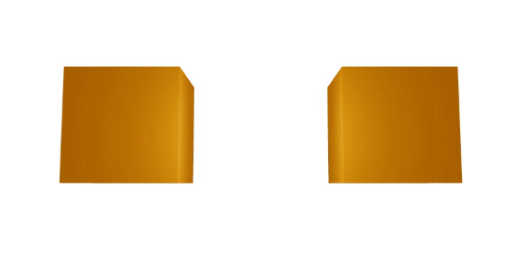

# Awesome React Three Fiber on React Native

I was having trouble finding resources on [React Three Fiber](https://r3f.docs.pmnd.rs/) running on React Native, so I made this list.

See also: [Awesome React Three Fiber](https://github.com/gsimone/awesome-react-three-fiber)

## Contributing

Please create PR’s (or issues) if you want to contribute! Just add an entry to this README. Self promotion is welcome.

## Getting started

- [Basic example](https://snack.expo.dev/@tomsoderlund/react-three-fiber-on-react-native---basic-example)

## Videos

- [3D Food Delivery App w/ React Native and React three Fiber ](https://www.youtube.com/watch?v=oCU5j5P20To)
- [React Native 3D Three.Js | Load 3D Model With React Three Fiber and Drei ](https://www.youtube.com/watch?v=O8q8H9c9XZ4)

